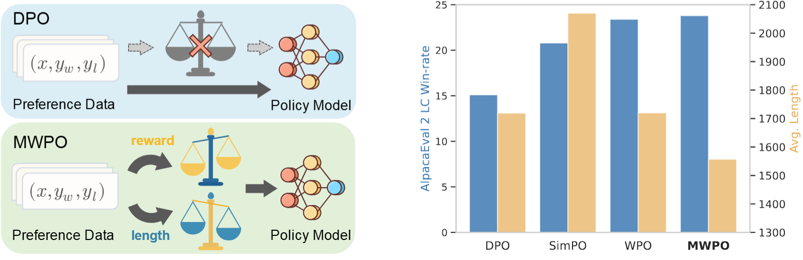

# MWPO: Enhancing LLMs Performance through Multi-Weight Preference Strength and Length Optimization

we propose to reweight preference pairs based on implicit reward margins and response length margins, unifying them through a geometric mixture to generate synthetic weights for optimization. This method allows preference pairs with stronger preference signals or more favorable length feature to have a more pronounced impact on model parameters. Moreover, our method does not require additional annotators.
</img>

## Training
We used [trl](https://github.com/huggingface/trl) as the training framework.

### Environment Setup

Our main experiments are conduct on `4 × Ascend-910b3 NPUs`
To set up the environment, please use `pip` install the specified dependencies in `requirments.txt`   

### Training Scripts
We provide training config files for training `Mistral-7B-Base` models in the paper.
U can start the training process as follows:
```shell
bash train.sh
```

## Models

the weight of our method as follows:

Mistral-7B-Base: https://huggingface.co/AIR-hl/Mistral-7B-Base-MWPO
